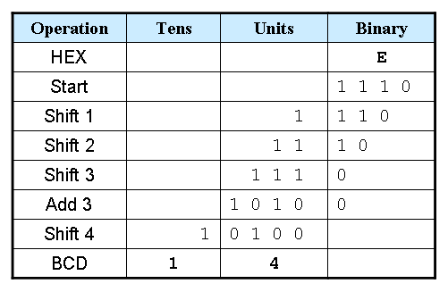
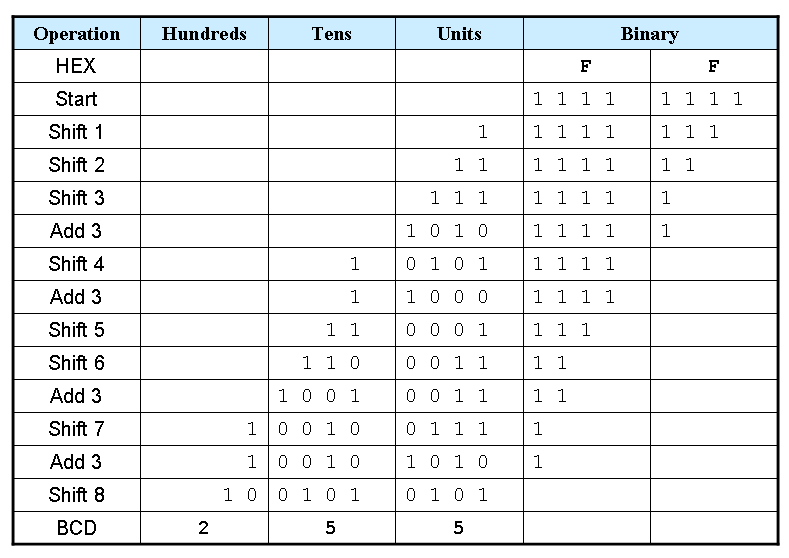
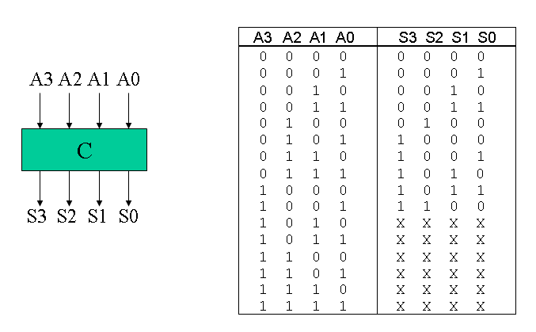
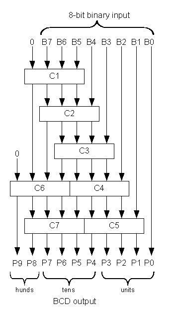

.. template for ReST
    *emphasise*
    **Bold**
    ``inline literal``
    `hyperlink <http://stuff.com>`_
    footnote ref[n]_.
        .. [n] footnote stuff with no : after "[n]"
    :ref:`text : to be linked` # will link to :
    .. _text \: to be linked:
    Word
        to define.
    r"""raw python like line"""
    #. auto enumerated stuff.
    #. auto enumerated stuff.
    .. image:: path/image.png
    .. NAME image:: path/image.png   // then after refered as |NAME|
    Titles, chapter and paragraphs :
    # with overline, for parts
    * with overline, for chapters
    =, for sections
    -, for subsections
    ^, for subsubsections
    ", for paragraphs

.. index:: Binary, Hacker,

.. _`Bin2BCD by John Loomis’`:

Binary to BCD Converter
=======================

:Author: `John Loomis <http://www.johnloomis.org/>`_
:source: `<http://www.johnloomis.org/ece314/notes/devices/binary_to_BCD/bin_to_bcd.html>`_
:Reference: course materials from `Prof. Richard E. Haskell <http://www.cse.secs.oakland.edu/haskell>`_
:Date: 2004-01-04

**Shift and Add-3 Algorithm**

#. Shift the binary number left one bit.

#. If 8 shifts have taken place, the BCD number is in the Hundreds, Tens, and Units column.

#. If the binary value in any of the BCD columns is 5 or greater, add 3 to that value in that BCD column.

#. Go to 1.

+-----------+----------+------+-------+-------------------+
| Operation | Hundreds | Tens | Units | Binary            |
+===========+==========+======+=======+=========+=========+
| HEX       |          |      |       | F       | F       |
+-----------+----------+------+-------+---------+---------+
| Start     |          |      |       | 1 1 1 1 | 1 1 1 1 |
+-----------+----------+------+-------+---------+---------+

****

Example 1: Convert hex E to BCD

Example 2: Convert hex FF to BCD

Truth table for Add-3 Module

Here is a Verilog module for this truth table.

::

    module add3(in,out);
    input [3:0] in;
    output [3:0] out;
    reg [3:0] out;

    always @ (in)
        case (in)
        4'b0000: out <= 4'b0000;
        4'b0001: out <= 4'b0001;
        4'b0010: out <= 4'b0010;
        4'b0011: out <= 4'b0011;
        4'b0100: out <= 4'b0100;
        4'b0101: out <= 4'b1000;
        4'b0110: out <= 4'b1001;
        4'b0111: out <= 4'b1010;
        4'b1000: out <= 4'b1011;
        4'b1001: out <= 4'b1100;
        default: out <= 4'b0000;
        endcase
    endmodule

**Binary-to-BCD Converter Module**

Here is a structural Verilog module corresponding to the logic diagram.

::

    module binary_to_BCD(A,ONES,TENS,HUNDREDS);
    input [7:0] A;
    output [3:0] ONES, TENS;
    output [1:0] HUNDREDS;
    wire [3:0] c1,c2,c3,c4,c5,c6,c7;
    wire [3:0] d1,d2,d3,d4,d5,d6,d7;

    assign d1 = {1'b0,A[7:5]};
    assign d2 = {c1[2:0],A[4]};
    assign d3 = {c2[2:0],A[3]};
    assign d4 = {c3[2:0],A[2]};
    assign d5 = {c4[2:0],A[1]};
    assign d6 = {1'b0,c1[3],c2[3],c3[3]};
    assign d7 = {c6[2:0],c4[3]};
    add3 m1(d1,c1);
    add3 m2(d2,c2);
    add3 m3(d3,c3);
    add3 m4(d4,c4);
    add3 m5(d5,c5);
    add3 m6(d6,c6);
    add3 m7(d7,c7);
    assign ONES = {c5[2:0],A[0]};
    assign TENS = {c7[2:0],c5[3]};
    assign HUNDREDS = {c6[3],c7[3]};

    endmodule

**General Binary-to-BCD Converter**

The linked code is a general `binary-to-BCD <http://www.johnloomis.org/ece314/notes/devices/binary_to_BCD/binary_to_bcd_v.html>`_ Verilog module, but I have not personally tested the code.

