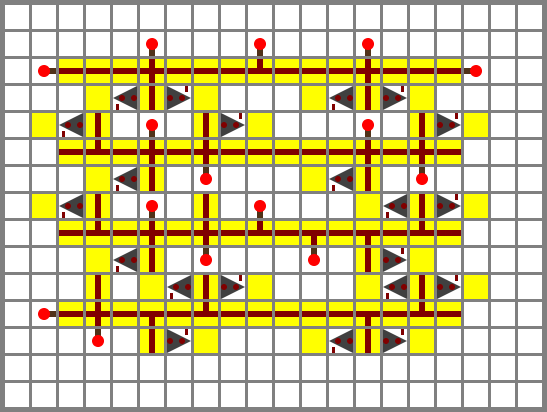
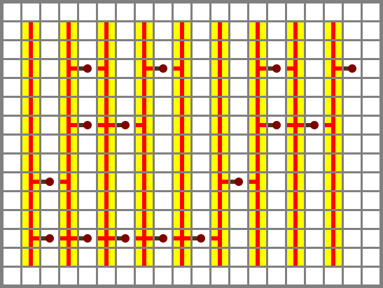
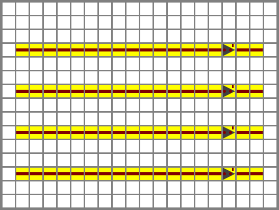
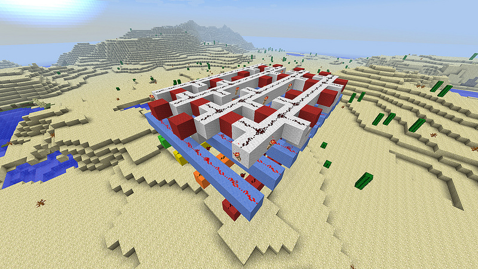

.. template for ReST
    toctree:
    Entries (titles directly)
    :maxdepth: 2
    :numbered:
    :titlesonly:
    :glob:  (files and folders)
    :hidden:

    .. math:: (a + b)^2 = a^2 + 2ab + b^2
        :label: truc \n
    some other paragraph with :eq:`truc` which ref. or :math:`inline maths`

    `hyperlink <http://stuff.com>`_
    hyperlink_
    .. _hyperlink: http://stuff.com

    footnote ref[n]_.
        .. [n] footnote stuff with no : after "[n]"

    :download:`title <file>`
    :ref:`text : to be linked` # will link to :
    .. _text \: to be linked:

    Word
        to define.
    r"""raw python like line"""
    #. auto enumerated stuff.
    #. auto enumerated stuff.
    .. figure:: path/image.png
    .. NAME figure:: path/image.png   // then after refered as |NAME|
    Titles, chapter and paragraphs :
    # with overline, for parts
    * with overline, for chapters
    =, for sections
    -, for subsections
    ^, for subsubsections
    ", for paragraphs

.. index::

.. _`bin2bdc`:

Binaire vers Decimal
====================
:Auteur: Sebastien Blanc Ryuutei
:Date: 2013-07-10
:Source: `Minecraft, Bin to BCD converter <https://ryuutei.wordpress.com/2013/07/10/Minecraft-bin-to-bcd-converter>`_ （anglais）

Last year I used to build my stupid unfinished broken processor  in Minecraft (which I finally downgraded to a weird and big adder :D), I was working on a bin to BCD converter too. Then I found the awesome Hans Lemurson’s Binary to BCD converter (who has decimals digits). For my output I copied the visible “bin input to selection rows” and made my own “selection part” and output. Because it’s impossible to see anything in the video… Anyway the most interesting and complex part was done by Hans Lemurson and it’s visible in the video [#HLf]_ . (my selector is certainly the same as him, because I don’t see any other way to make it in such a compact building.)

    First (upper) layer of the Binary to BCD converter

Input & “Algorithm” part:
-------------------------
The upper layer is the main algorithm, that will permanently light the beneath layer when no input is done. (see why in the “selector” part)

The 4 horizontal rows are the binary input. They are easily powered by a torch from above. From up to bottom they are the input of  ``0b0001``, ``0b0010``, ``0b0100`` & ``0b1000``.

For example, the first input row will keep the selector rows 2, 4, 6 and 8 powered while the other will be shutdown. ⁖ When there is an input, the torchs will not provide power to the selector layer, while the repeaters will.

    Second (middle) layer of the Binary to BCD converter.

”Selector” part:
----------------

all lines of this layer must be powered when there’s no input. When a line isn’t powered it will light the output (ie. it’s just a big inverted output.)

From left to right the values of those columns are: 1001, 1000, 111, 110 101, 100, 11, 10, 1. This part is pretty easy to understand and it’s self explanatory.

N.B. torches in this level mustn’t have a bloc above, at the risk of powering a line beside, it’s the blocs where sits the repeaters that will bring problems ; I made the mistake inadvertently twice. :p (stupid mistakes)

    Third (bottom) layer of the Binary to BCD converter

Output/BCD Line:
----------------

This last layer may be the final binary coded decimal output or another converter if you want bigger input, but everything about this is really well explained in the John Loomis’ paper [#JLf]_ .

There’s nothing special in this layer that need an explanation.

In conclusion this is a really smart construction that let’s you stack a in a neat way many convertors. And the pattern it’s not too complicated to remember.

**References:**

.. [#HLf] `video de Hans Lemurson. <http://youtu.be/Z-JxYhm3EsI>`_ 
.. [#JLf] :ref:`Bin2BCD by John Loomis’`

****

****

Bin to BCD converter
====================
:Author: Sebastien Blanc Ryuutei
:Date: 2013-07-10
:Source: `Minecraft, Bin to BCD converter <https://ryuutei.wordpress.com/2013/07/10/Minecraft-bin-to-bcd-converter>`_

Last year I used to build my stupid unfinished broken processor  in Minecraft (which I finally downgraded to a weird and big adder :D), I was working on a bin to BCD converter too. Then I found the awesome Hans Lemurson’s Binary to BCD converter (who has decimals digits). For my output I copied the visible “bin input to selection rows” and made my own “selection part” and output. Because it’s impossible to see anything in the video… Anyway the most interesting and complex part was done by Hans Lemurson and it’s visible in the video [#HL]_ . (my selector is certainly the same as him, because I don’t see any other way to make it in such a compact building.)

    First (upper) layer of the Binary to BCD converter

Input & “Algorithm” part:
-------------------------
The upper layer is the main algorithm, that will permanently light the beneath layer when no input is done. (see why in the “selector” part)

The 4 horizontal rows are the binary input. They are easily powered by a torch from above. From up to bottom they are the input of  ``0b0001``, ``0b0010``, ``0b0100`` & ``0b1000``.

For example, the first input row will keep the selector rows 2, 4, 6 and 8 powered while the other will be shutdown. ⁖ When there is an input, the torchs will not provide power to the selector layer, while the repeaters will.

    Second (middle) layer of the Binary to BCD converter.

”Selector” part:
----------------

all lines of this layer must be powered when there’s no input. When a line isn’t powered it will light the output (ie. it’s just a big inverted output.)

From left to right the values of those columns are: 1001, 1000, 111, 110 101, 100, 11, 10, 1. This part is pretty easy to understand and it’s self explanatory.

N.B. torches in this level mustn’t have a bloc above, at the risk of powering a line beside, it’s the blocs where sits the repeaters that will bring problems ; I made the mistake inadvertently twice. :p (stupid mistakes)

    Third (bottom) layer of the Binary to BCD converter

Output/BCD Line:
----------------

This last layer may be the final binary coded decimal output or another converter if you want bigger input, but everything about this is really well explained in the John Loomis’ paper [#JL]_ .

There’s nothing special in this layer that need an explanation.

In conclusion this is a really smart construction that let’s you stack a in a neat way many convertors. And the pattern it’s not too complicated to remember.

**References:**

.. [#HL] `Hans Lemurson’s video. <http://youtu.be/Z-JxYhm3EsI>`_ 
.. [#JL] :ref:`Bin2BCD by John Loomis’`
